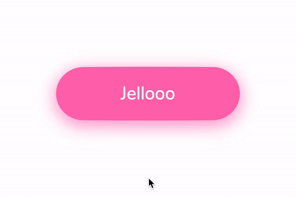

# A Jelly Button made with SVG and CSS

Combine the power of SVG and CSS animation to obtain a wobbly button that would not otherwise be possible using classic HTML elements.

## How does it work?

The jelly button is made of 3 main state:
* default (button-default.svg)
* active (button-active.svg)
* hover (button-hover.svg)

We use CSS to animate the transition between the different states, also using the `cubic-bezier` method to manipulate the curve.

